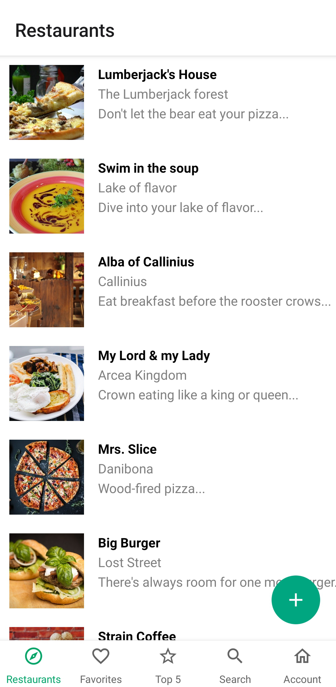
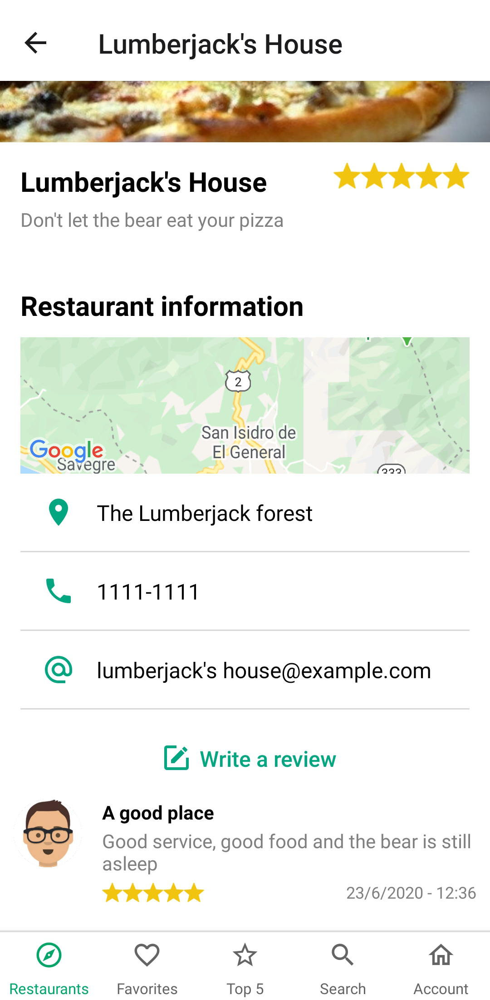
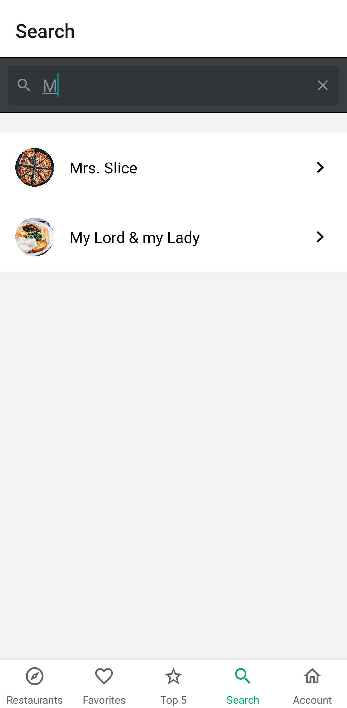
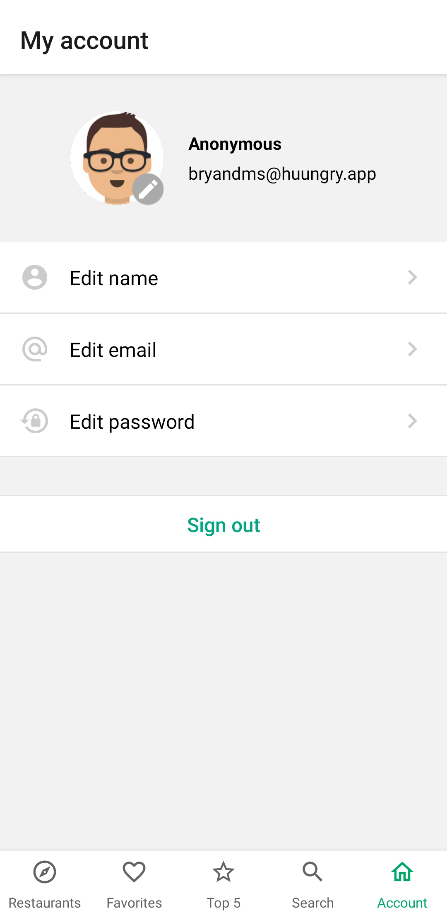

<div align="center">

# Huungry

[Acerca del proyecto](#acerca-del-proyecto) | [Instalar](#instalar) | [Capturas de pantalla](#capturas-de-pantalla)

[:es:](README-ES.md) | [:us:](README.md)

</div>

## Acerca del proyecto

Aplicación móvil para ver reseñas y calificaciones de restaurantes, guiado por el curso de [Udemy](https://www.udemy.com/course/react-native-expo-creando-mini-tripadvisor-de-restaurantes/).

**Construído con:**

- [React Native](https://reactnative.dev/)
- [React Native Elements](https://react-native-elements.github.io/react-native-elements/)
- [Firebase](https://firebase.google.com/)

## Instalar

**Paso 1:** Clone o descargue el repositorio.

**Paso 2:** Cambie al directorio de su repositorio.

```bash
cd /ruta/de/su/repo
```

**Paso 3:** Instale las dependencias.

```bash
# NPM
npm i

# Yarn
yarn
```

**Paso 4:** Duplique el archivo `.env-example` y cambie el nombre a `.env` y cambie las variables de entorno.

```bash
cp .env.example .env
```

**Paso 5:** Agregue su _API key_ al archivo `app.json`.

**Paso 6:** Inicie el proyecto.

```bash
# NPM
npm start

# Yarn
yarn start
```

## Capturas de pantalla

<div style="display: inline-block; margin-right: 20px">
  <h4>Restaurantes</h4>
  
</div>

<div style="display: inline-block; margin-right: 20px">
  <h4>Nuevo restaurante</h4>
  
</div>

<div style="display: inline-block; margin-right: 20px">
  <h4>Restaurante</h4>
  
</div>

<div style="display: inline-block; margin-right: 20px">
  <h4>Mis favoritos</h4>
  
</div>

<div style="display: inline-block; margin-right: 20px">
  <h4>Top 5</h4>
  
</div>

<div style="display: inline-block; margin-right: 20px">
  <h4>Buscador</h4>
  
</div>

<div style="display: inline-block; margin-right: 20px">
  <h4>Perfil</h4>
  
</div>
