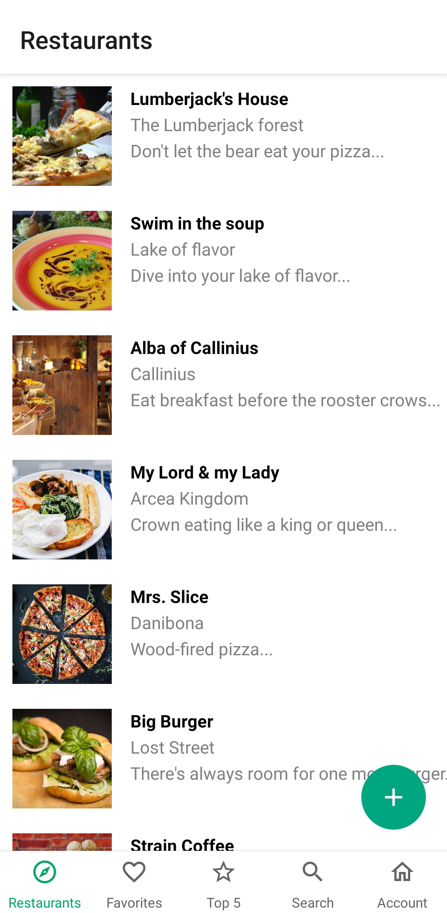
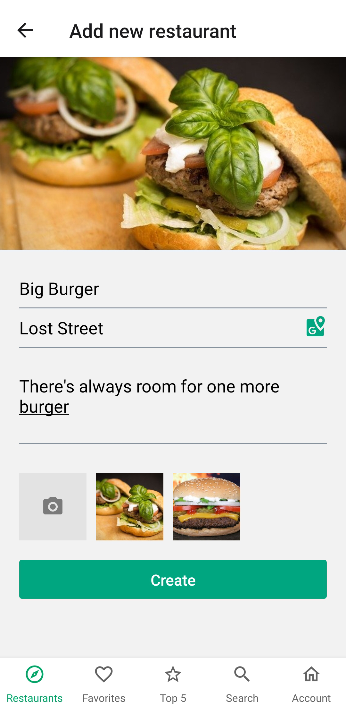
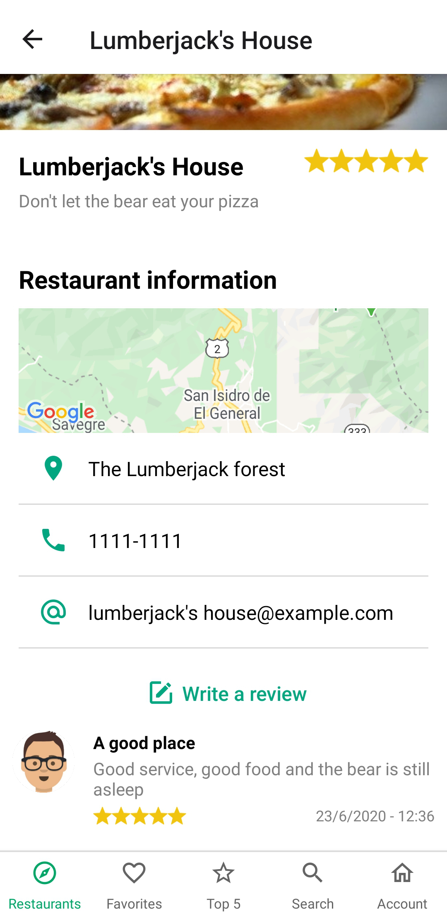
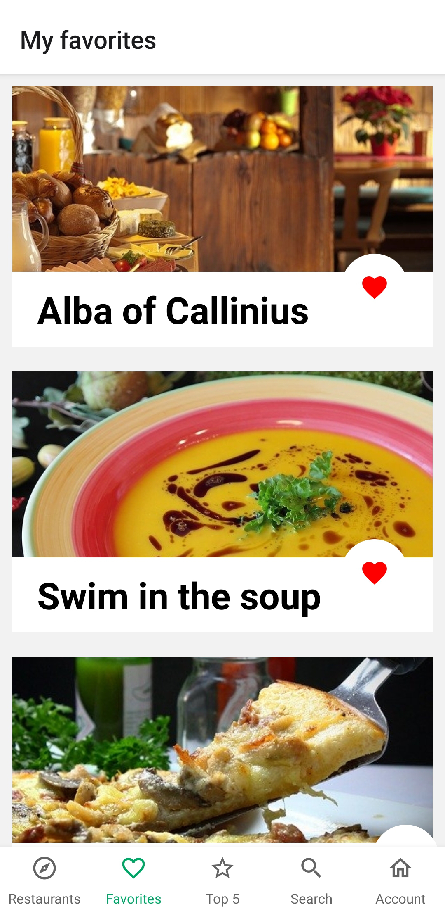
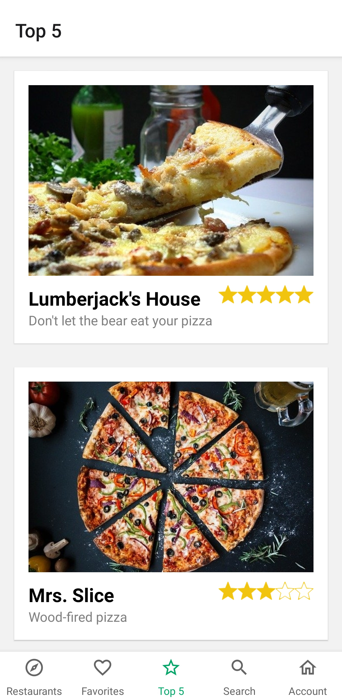
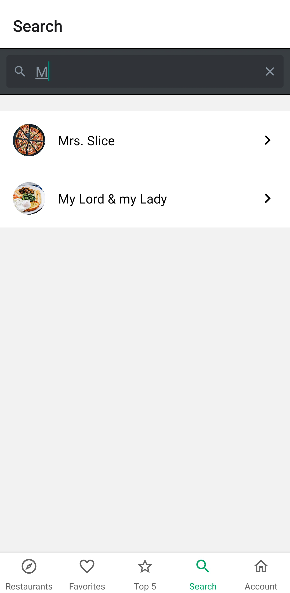
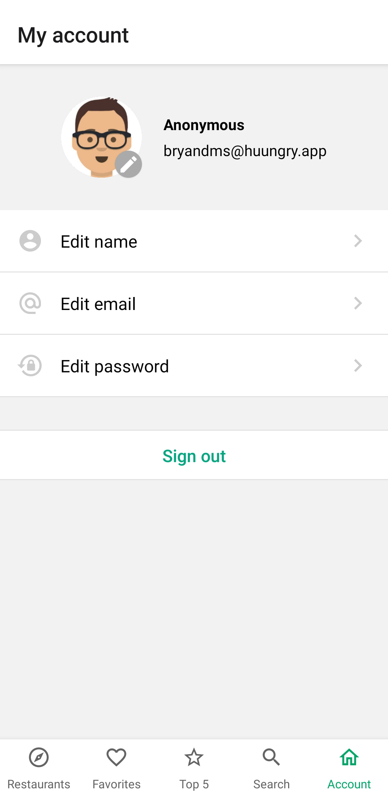

<div align="center">

# Huungry

[About the Project](#about-the-project) | [How to Install](#how-to-install) | [Screenshots](#screenshots)

[:es:](README-ES.md) | [:us:](README.md)

</div>

## About The Project

Mobile app to see restaurant reviews and ratings, guided by the [Udemy](https://www.udemy.com/course/react-native-expo-creando-mini-tripadvisor-de-restaurantes/) course.

**Built with:**

- [React Native](https://reactnative.dev/)
- [React Native Elements](https://react-native-elements.github.io/react-native-elements/)
- [Firebase](https://firebase.google.com/)

## How to Install

**Step 1:** Clone or download the repo.

**Step 2:** Switch to your repository's directory.

```bash
cd /path/to/your/repo
```

**Step 3:** Install dependencies.

```bash
# NPM
npm i

# Yarn
yarn
```

**Step 4:** Duplicate the `.env.example` file and rename it to `.env` and change the environment variables.

```bash
cp .env-example .env
```

**Step 5:** Add your _API key_ to the `app.json` file.

**Step 6:** Start the project.

```bash
# NPM
npm start

# Yarn
yarn start
```

## Screenshots

<div style="display: inline-block; margin-right: 20px">
  <h4>Restaurants</h4>
  
</div>

<div style="display: inline-block; margin-right: 20px">
  <h4>New restaurant</h4>
  
</div>

<div style="display: inline-block; margin-right: 20px">
  <h4>Restaurant</h4>
  
</div>

<div style="display: inline-block; margin-right: 20px">
  <h4>My favorites</h4>
  
</div>

<div style="display: inline-block; margin-right: 20px">
  <h4>Top 5</h4>
  
</div>

<div style="display: inline-block; margin-right: 20px">
  <h4>Search</h4>
  
</div>

<div style="display: inline-block; margin-right: 20px">
  <h4>Profile</h4>
  
</div>
